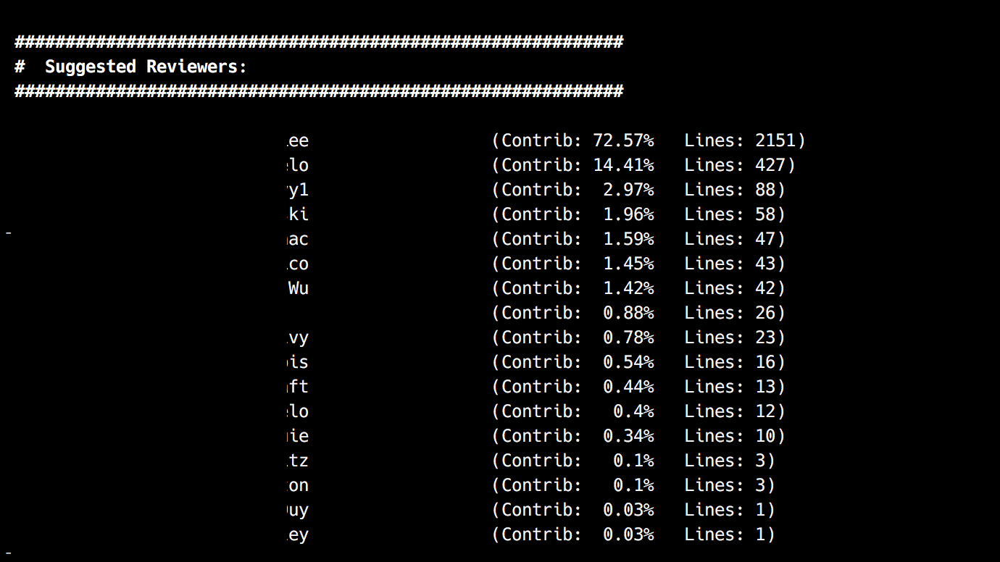

# git-reviewers

**Tested with python 2.7.12 and 3.5.2 but probably will work with >=2.5**

**Tested with git version 2.11.0**

Wouldn't it be nice if git could give you this output when you have a large PR working with a big team?



When working on a large team or in a large company, sometimes its difficult to
tell who you should add as a reviewer to a pull request... especially when
your PR spans multiple files/modules.  Everyone can’t be monitoring for new
PRs all the time, especially across many codebases.

The theory behind this is that if you’re changing a line of code in the vicinity
of what someone has touched, maybe they should be notified of the PR for review.
It accomplishes this by using the `git blame` of the lines around the diff of
a branch.

## Installation

You can easily install the utility by running the following command:

```bash
curl -o- https://raw.githubusercontent.com/johnnadratowski/git-reviewers/master/install.sh | INSTALL_DIR=/usr/local/bin bash
```
**INSTALL_DIR must be on your $PATH. If not specified, defaults to `/usr/local/bin`.**

Alternatively, you can clone the repo and run `install.sh` manually.

You can update it by re-running this command as well.
## Usage

```
# This will tell you the potential reviewers of the branch, ordered by most prolific, against master
git reviewers -b master

# If you omit -b, it will default first to a `develop` (a la git flow) branch, 
# then to `master` if no `develop` branch exists
git reviewers

# If you only want to see suggested reviewers for certain files:
git reviewers app/test/testfoo.py app/test/testbar.py

# If you want to use this to pipe to another command, 
# you can dump out the raw in-memory data structures as JSON
git reviewers --output=raw

# Specifying a contributer will drop into a ‘diff’ mode, showing you the lines of
# code the contributer has touched in/near your changes
# NOTE: if Pygments is installed, it gives nice syntax highlighting
git reviewers -c “Sally” app/test/testfoo.py app/test/testbar.py
```

## How does it work?

The implementation is really simple, actually.  First, it gets all of the files changed using `git diff --stat`.  Then it will get all of the lines around your changes using `git diff` for each file.  It then splits up the chunks of those ranges to feed to `git blame -L {line numbers}` to get the people who
are familiar with the code.

There are definitely opportunities to improve. Right now it simply counts up the lines, determines the contribution % of each contributer, sorts them, and outputs the information.  However it could be much smarter, and look at what the line of code is doing, or have some weighted value for each type of line depending on what happened in the file.

Also, if you only added files, it has nothing to compare.  In that case it probably makes sense to look at the other files in the module or something else, like the modules that import the new file.

During the install, to make the git subcommand, I clone the repo and create a zip file containing the `__main__.py` and associated code.  This gets installed somewhere on $PATH that git can understand as a subcommand by naming it `git-reviewers`.  A good tutorial on the python zip file executables was written by [Don McCaughey here](http://blog.ablepear.com/2012/10/bundling-python-files-into-stand-alone.html).
